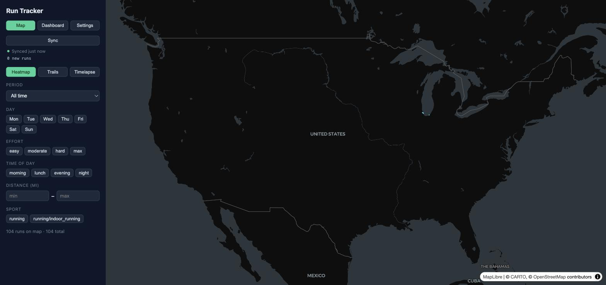
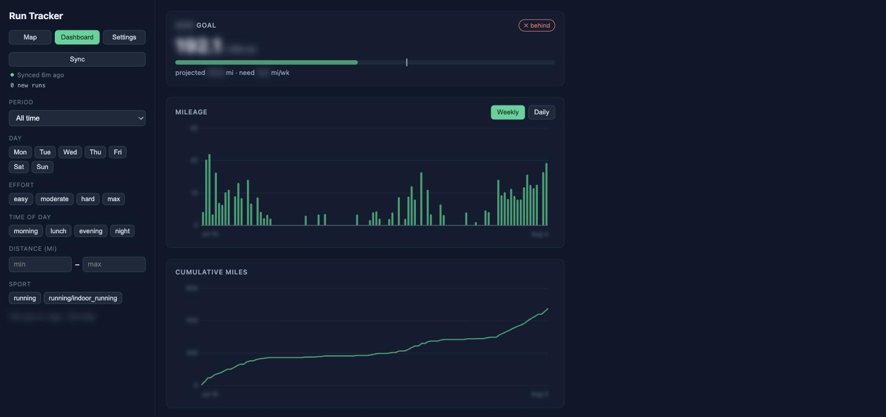

# Run Tracker

Map and run tracker for a COROS Pace 3 runner: filterable run history, mileage/goal
dashboards, and map art (heatmap, HR/pace gradient trails, and timelapse — aligned-start
or chronological).

- Vocabulary: [CONTEXT.md](CONTEXT.md)
- Why FIT-files-on-disk is the ingestion contract: [ADR 0001](docs/adr/0001-fit-files-on-disk-as-ingestion-contract.md)

## Screens

Both shots are deliberately anonymized — the map is zoomed out to the whole country so no
route is legible, and the dashboard's figures are blurred. On your own machine the map
opens fitted to your runs and the numbers are sharp.

**Map — heatmap over the dark basemap.** The landing screen: every run in the active
filter drawn as an alpha-stacked path, so repetition builds brightness. Mode buttons swap
to Trails or Timelapse; the filter panel on the left drives every view.



**Dashboard — goal and weekly overview.** Goal card with progress meter and a
where-you-should-be-today marker, then weekly mileage bars (Weekly | Daily toggle),
cumulative miles, and pace trend.



## Setup

```sh
cp .env.example .env   # fill in COROS credentials
make up
```

- Frontend: http://localhost:5173
- API: http://localhost:8000/api/health

Set `COROS_API_BASE` in `.env` to your account's home region — US
`https://teamapi.coros.com` (default) or EU `https://teameuapi.coros.com`;
tokens from the wrong region fail every data call.

macOS note (OrbStack/Docker Desktop): the app needs Files-and-Folders permission for the
folder holding this repo, or bind mounts fail with "Operation not permitted".

No COROS credentials? Unzip an official Training Hub bulk export into `data/fit/` — the
app ingests whatever FIT files it finds there.

### Tests

```sh
docker compose exec backend sh -c "cd /app && python -m pytest tests"
docker compose exec frontend sh -c "cd /app && npm test"
```

### Without Docker

```sh
cd backend && uv run uvicorn app.main:app --port 8000   # serves data/app.db
cd frontend && npm install && npm run dev               # http://localhost:5173
```

The backend reads its config from the environment, which Docker supplies from `.env`.
Running it directly, export the file first (`set -a; . ../.env; set +a`) or sync will
report missing credentials.

## Features

**Ingestion.** `ingest/fetcher.py` wraps `corosexport` with the credentials from `.env`
and downloads run FIT files into `data/fit/`; `ingest/parser.py` turns them into runs via
`fitdecode`. Ingest is idempotent by filename, so re-drops and bulk zips are safe. Sync
runs on startup and behind the Sync button, which reports last-sync status and new-run
count; failures land in `sync_log` and never block the app.

**Filters.** Period (`7d/30d/90d/ytd/year-YYYY/all` plus custom dates), Day, Effort,
Distance, Time-of-day, and Sport — all comma multi-select, all resolved in one place
(`filters.py`) into a single WHERE clause. Every clause starts with the Run floor:
activities under 1 mile are stored but are not Runs, so no view, total, Goal, or
Timelapse counts them.

**Map views.** Three deck.gl modes over a MapLibre dark basemap, all fed by one shared
tracks fetch:

- **Heatmap** — alpha-stacked cyan paths; repetition builds brightness.
- **Trails** — each segment colored by its zone, either HR bucketed by Effort or pace
  bucketed by your three Pace Zone thresholds, with an on-map legend.
- **Timelapse** — playback with play/pause/scrub and 10–600× speed, in two timing modes:
  aligned-start (every run's t=0 together, trails branching outward) and chronological
  (runs draw in date order, each starting as the previous finishes).

**Dashboard.** One `/api/dashboard` payload drives the goal card (progress, projection,
today's marker), the mileage bars with a Weekly | Daily toggle (weekly is
calendar-continuous and gap-filled; daily shows only Run Days), cumulative miles, and the
pace trend (dots plus a 5-run rolling mean, faster-is-up) — hand-rolled SVG with hover
tooltips and a collapsible data table. Charts follow the active filters; **Goal status
always covers the whole calendar year** regardless of them.

**Settings.** Annual goal miles, max HR, Pace Zone thresholds (mm:ss), Privacy Zones, and
the Start Zone toggle. Effort and Pace Zones are computed at read time, never stored, so
editing max HR or a threshold re-buckets all history instantly.

**Art export.** In Timelapse mode, ⏺ Record plays exactly one full loop and captures what
the map shows (composited basemap + trails via MediaRecorder); the clock stops the
recording at the loop end, and the speed slider doubles as video-length control. The
browser's WebM is transcoded by `POST /api/export/mp4` (ffmpeg, h264 + faststart); if
transcoding fails the WebM downloads instead, so an export always lands. Privacy Zones
and the Start Zone trim points on export only — the local map is never trimmed.

### Backlog

Effort distribution chart, poster grid, elevation gradient trails, calendar feature,
race-training goals.

## Tech stack

| Layer | Used |
|-------|------|
| Backend | Python 3.12, FastAPI, uvicorn, SQLite (stdlib `sqlite3`), [uv](https://docs.astral.sh/uv/) |
| Ingestion | `corosexport` (unofficial COROS API), `fitdecode` |
| Frontend | React 18, TypeScript, Vite |
| Map | MapLibre GL + deck.gl, CARTO dark-matter basemap |
| Charts | Hand-rolled SVG (no chart library) |
| Video | MediaRecorder in the browser, ffmpeg in the backend image |
| Tests | pytest + httpx (backend), Vitest (frontend) |
| Dev | Docker Compose, hot reload via bind mounts |

### API

| Endpoint | Purpose |
|----------|---------|
| `POST /api/sync`, `GET /api/sync/status` | Fetch + ingest, and last-sync state |
| `GET /api/meta` | Filter vocabulary, zone config, run count, date range |
| `GET /api/runs`, `GET /api/runs/{id}/track` | Run list and one run's track points |
| `GET /api/tracks` | All filtered tracks for the map, under a `max_points` budget |
| `GET /api/dashboard` | Weekly/daily mileage, cumulative, pace trend, goal projection |
| `GET/PUT /api/settings` | Goal, max HR, pace thresholds, privacy/start zones |
| `POST /api/export/mp4` | Transcode a recorded WebM to MP4 |

Shared seams worth knowing: `store.py` holds every SQL statement (with a `:memory:`
adapter for tests), `effort.py` owns the one HR bucketing, `timeline.ts` owns all
Timelapse time math, and `trackpoint.py`/`trackpoint.ts` define the
`[lon, lat, t_offset_s, hr, pace_s_per_mi]` wire tuple once per side of the HTTP seam.

## Data & privacy

Everything under `data/` is personal — GPS tracks reveal home and work locations — and is
gitignored along with `.env` credentials. Exported art (MP4s) also carries location data:
Privacy Zones trim points near saved locations, and the Start Zone toggle trims a 400 m
radius around each run's own start point, catching finishes that return near the start.

The screenshots above run on real data but are anonymized before capture — the map zoomed
out past the point where any route is legible, and every figure on the dashboard blurred.
Keep that in mind if you re-shoot them.
